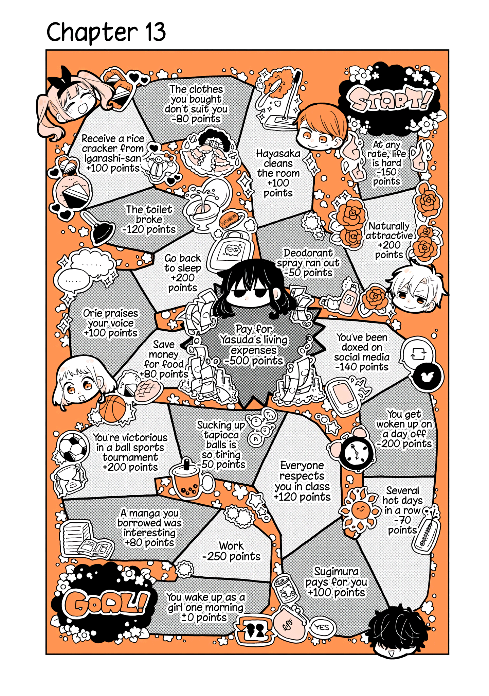

# WUGOM-Board-Game
A command line Python3 version of the board game from the title page of chapter 13 from the manga: A Lazy Guy Woke Up as a Girl One Morning

## Usage
```shell
game.py -arg
```
## Game Modes
**SHORT**
You roll the dice until you reach or pass the goal
```shell
-s -short
```
**LONG**
You must keep rolling the dice until you land exactly on the goal, if you go past it you will be sent back to the start
```shell
-l -long
```
